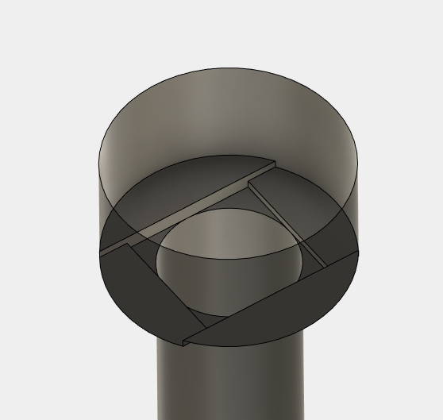
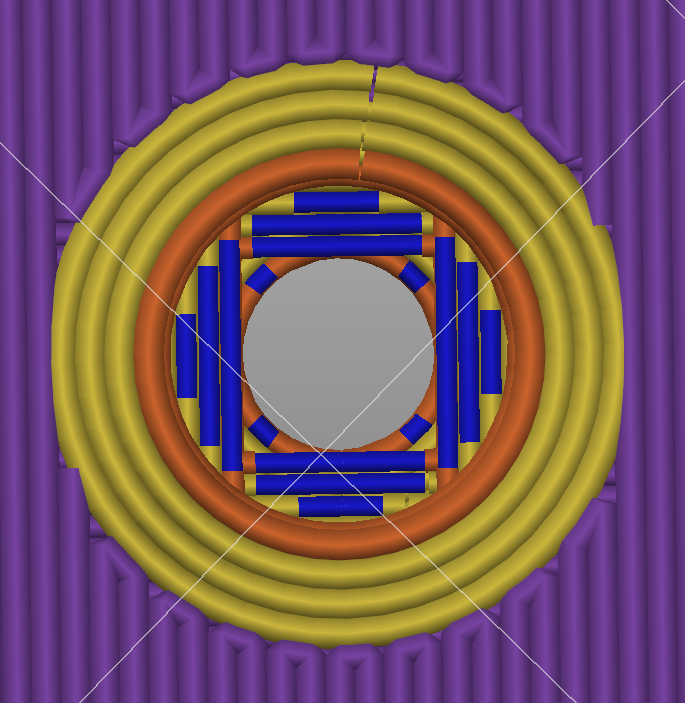
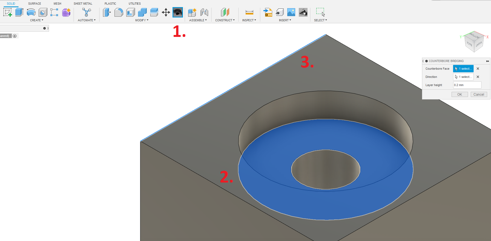

# Counterbore Bridging

This is an addin for Autodesk Fusion360 that provides easy optimization of counterbores for FDM 3d printing.

## Installation

1. Clone this repository to `%appdata%\Autodesk\Autodesk Fusion 360\API\AddIns` (for me, the specific path is `C:\Users\Finn\AppData\Roaming\Autodesk\Autodesk Fusion 360\API\AddIns` and Mac: `~/Library/Application\ Support/Autodesk/Autodesk\ Fusion\ 360/API`).  
Make sure, the folder is named `CounterboreBridging` (i.e. if you downloaded the repo as .zip).

2. Restart Fusion. 
3. The addin will show up in `Design Workspace - Solid Tab - Modify Group` next to the `Move/Copy` command.

You may need to activate it manually in `Design Workspace - Utilities Tab - Addins Group - Scripts and Addins`.

## Usage
Create a part with a cylindrical counterbore (e.g. using the `Hole` command or generic extrusions). Then:
1. Activate the command
2. Select one or more counterbore faces
3. Select an edge the primary bridges should be parallel to

