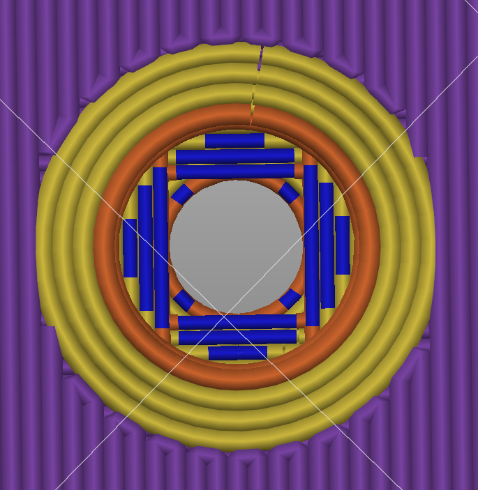

# 沉孔搭桥

这是一个适用于 Autodesk Fusion360 的插件，用于为 FDM 3D 打印优化沉头孔结构。

## 安装方法

1. 克隆本仓库到 `%appdata%\Autodesk\Autodesk Fusion 360\API\AddIns` 目录下（例如：`C:\Users\Finn\AppData\Roaming\Autodesk\Autodesk Fusion 360\API\AddIns`，Mac 用户为 `~/Library/Application\ Support/Autodesk/Autodesk\ Fusion\ 360/API`）。
请确保文件夹名称为 `CounterboreBridging`（如果你是以 zip 文件方式下载的仓库）。

2. 重启 Fusion。
3. 插件将在 `设计工作区 - 实体选项卡 - 修改分组` 中显示，在 `平移/复制（Move/Copy）` 命令旁边。

如果未自动激活，你可以手动在 `设计工作区 - 工具选项卡 - 插件分组 - 脚本与插件（Scripts and Addins）` 中启动插件。

## 使用方法
先创建一个带有圆柱形沉头孔的零件（例如使用 `孔(Hole)` 命令或普通拉伸）。然后：
1. 启用该命令
2. 选择一个或多个沉头孔底面
3. 选择一个主要桥接应平行于的边

